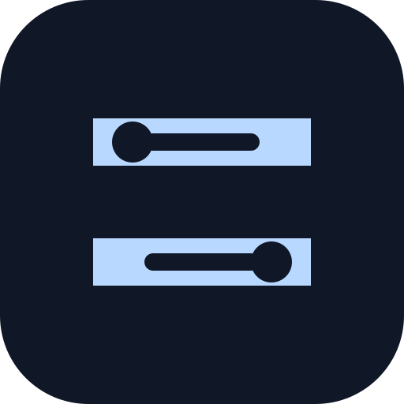
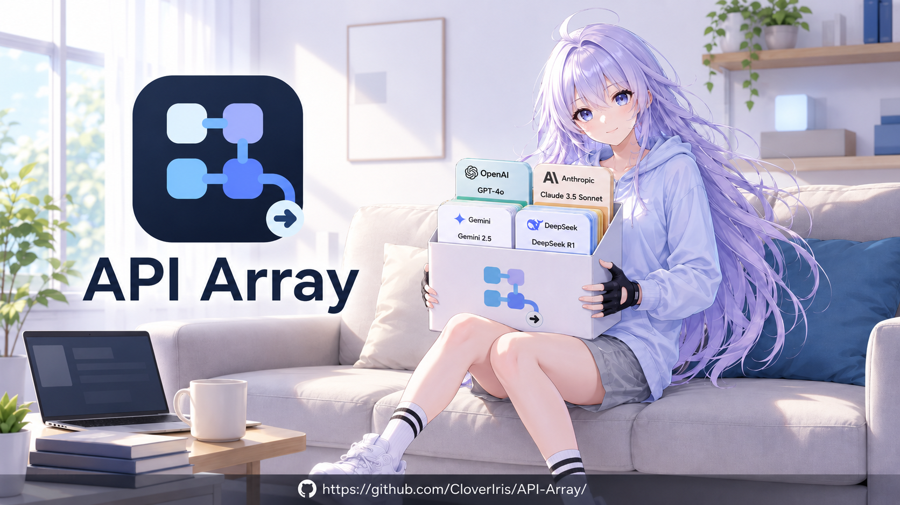
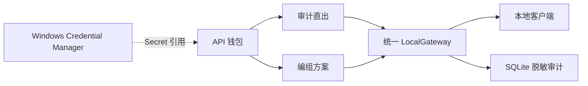

<p align="center">
  
</p>

<h1 align="center">API ARRAY</h1>

<p align="center">
  <strong>API ARRAY 1.0.0 Preview</strong><br>
  A local-first API wallet, audited gateway, and visual composition workspace for Windows.
</p>

<p align="center">
  
  
  
  
  
  
  
  
  
  <a href="LICENSE"></a>
  <a href="https://github.com/CloverIris/API-Array/stargazers"></a>
</p>

<p align="center">
  <strong>简体中文</strong> · <a href="README_EN.md">English</a>
</p>

<!-- Marketing hero placeholder: replace the logo below with docs/assets/api-array-hero.png when final artwork is ready. -->

## 项目简介

API ARRAY 是面向 Windows 10/11 的本地优先 API 管理、审计转发与可视化编组工具。它把分散在不同供应商、中转站和协议中的 API 收进一个安全的钱包，再通过统一的本地网关提供稳定、可审计、OpenAI-compatible 的调用入口。

产品围绕三条清晰的工作流展开：

1. **API 钱包**：保存已有 Provider、Base URL、Key 引用、能力报告、健康状态和预算规则。
2. **审计直出**：把单个钱包资产发布为独立的 localhost 入口，保留独立 Token、模型映射、运行状态与审计记录。
3. **编组模式**：在项目、文件夹与编组方案中组合多个上游，配置模型集合、主备路由、健康探测和能力策略，再发布新的统一 API。

API ARRAY 不要求 Docker 或独立 Web 服务。桌面宿主、Rust Runtime 和 LocalGateway 在同一应用中运行；关闭主窗口后，应用可以继续在系统托盘常驻。
<p align="center">
  
</p>

## 核心特性

- **多供应商 API 钱包**：内置 OpenAI、Anthropic、Gemini 与 Custom OpenAI-compatible Provider 描述，并支持同一供应商的多个实例。
- **统一 Canonical 协议层**：不同上游协议由 Rust Adapter 转换，出口统一提供 OpenAI-compatible API。
- **可视化编组方案**：使用 Provider、Composer、Middleware、Probe 与 Publisher 构建可验证的服务计划。
- **本地审计网关**：Direct Endpoint 与编组方案共享单一 LocalGateway，入口、Token 和审计主体保持隔离。
- **安全凭据管理**：Key 与本地 Token 存入 Windows Credential Manager；SQLite 只保存 `secret://` 引用。
- **Windows Hello 保护**：Windows 11 上查看或安全复制 Key 需要系统身份验证；Windows 10 保持不显示明文的安全降级。
- **脱敏运行记录**：记录入口、模型、结果、延迟、重试、切换与 Token 用量，不记录正文、URL、Header 或凭据。
- **接口文档与八语言示例**：根据当前入口能力生成 Markdown 文档，以及 cURL、Python、JavaScript/TypeScript、Go、Rust、Java、C# 和 C++ 示例。
- **Windows 桌面体验**：Tauri 2、自定义标题栏、Mica/Acrylic、不透明降级、托盘常驻与开机启动。

## 工作原理



编组方案内部使用 Canonical 服务计划，而不是模拟单次 HTTP 请求流：

```text
Provider ── Candidate ──> Composer ── ServicePlan ──> Middleware ──> Publisher
Probe ── HealthSignal ────────────────────────────────┘
```

## 安全模型

- LocalGateway 默认监听 `127.0.0.1:7480`，也可配置为 `::1` 和其他本地端口；Preview 不允许公网绑定。
- 上游 Key 和本地入口 Token 不写入 SQLite、日志、通知、导出或前端持久状态。
- 上游鉴权 Header 不会透传给本地客户端。
- 工作区导出和诊断信息必须保持脱敏。
- Provider YAML 只描述受控配置，不能执行脚本或读取任意文件。
- 运行时网络调用不要求每次 Windows Hello；只有向用户显示或复制明文 Secret 时才触发验证。

## 技术架构

| 层级 | 技术 | 职责 |
|---|---|---|
| Desktop UI | Next.js 16、React 19、TypeScript 5.9、Tailwind CSS 4、Apps SDK UI | OOBE、钱包、主控台、编组画布、文档与设置 |
| Visual Editor | React Flow / XYFlow 12 | Graph V2 的可视化编辑、Handle、节点位置和视口 |
| Desktop Host | Tauri 2 | 窗口、托盘、文件对话框、IPC、应用生命周期与 Windows 集成 |
| Core | Rust 1.97、Edition 2024 | 领域模型、Provider Schema、Graph 校验、编译与文档生成 |
| Runtime | Tokio、Axum、Reqwest + Rustls | LocalGateway、协议 Adapter、路由、流式转发、重试与审计 |
| Storage | SQLite / rusqlite | 工作区、运行记录、通知、报告与版本化配置 |
| Security | Windows Credential Manager、Windows Hello | Secret 存储以及受控的明文查看和复制 |

Core 和 Runtime 不依赖 React 或 Next.js。桌面前端通过受控 Tauri IPC 操作领域服务，不直接访问数据库、凭据保险库或上游 API。

## 仓库结构

```text
APIArray/
├── README.md
├── LICENSE
├── docs/                         # 冻结 PRD 与版本化产品设计变更
└── src/
    ├── product-version.json      # 唯一版本源
    ├── Cargo.toml                # Rust workspace
    ├── providers/                # 内置 Provider YAML
    ├── crates/
    │   ├── apiarray-core/        # 领域模型、Graph、编译与文档
    │   ├── apiarray-runtime/     # Storage、Gateway、Adapter 与审计
    │   ├── apiarray-cli/         # 独立诊断 CLI
    │   └── apiarray-windows-security/
    └── apps/desktop/
        ├── src/                  # Next.js / React 桌面界面
        └── src-tauri/            # Tauri Windows 宿主
```

## 环境要求

- Windows 10 或 Windows 11 x64
- Node.js 与 npm
- Rust `1.97` 或更高版本
- MSVC C++ Build Tools 与 Windows SDK
- Microsoft Edge WebView2 Runtime
- 构建 MSI 时需要 WiX Toolset v3，并启用 Windows VBSCRIPT 可选功能

## 快速开始

```powershell
git clone https://github.com/CloverIris/API-Array.git
cd API-Array\src\apps\desktop
npm.cmd install
npm.cmd run dev
```

`npm.cmd run dev` 会依次启动 Next.js 开发服务器、Tauri 桌面宿主和进程内 Rust Runtime。不要把直接双击 `src/target/debug` 下的旧可执行文件当作完整开发流程。

## 测试与验证

前端测试与静态导出：

```powershell
cd src\apps\desktop
npm.cmd test
npm.cmd run build
```

Rust Workspace：

```powershell
cd src
cargo test --workspace
cargo check --workspace
```

完整桌面 Debug 构建：

```powershell
cd src\apps\desktop
npm.cmd run build:desktop:debug
```

真实 Provider 验证必须使用用户明确授权的凭据。默认先执行 `/v1/models` 等无副作用检查；任何可能计费的生成请求都应由用户明确触发。

## 构建 Preview MSI

```powershell
cd src\apps\desktop
npm.cmd run release:preflight
npm.cmd run release:verify
npm.cmd run release:msi
```

发布流程会校验版本、MSVC、WiX、VBSCRIPT、WebView2 配置和图标资源，并生成 MSI、SHA-256 与 Preview 发布说明。产物写入 `src/release/`，不会进入 Git。

当前 Preview MSI 未进行代码签名，Windows SmartScreen 可能显示未知发布者提示。正式对外分发前请核对校验值，并仅从可信仓库或发布页面获取安装包。

## 工作区与本地数据

API ARRAY 使用目录包管理工作区：

```text
workspace/
├── workspace.sqlite3
├── attachments/
├── exports/
└── backups/
```

应用级 `launcher.sqlite3` 只记录最近工作区与路径，不存放业务 Secret。工作区 SQLite 保存配置、图、报告、通知和脱敏审计；真正的 Key 与入口 Token 始终存入 Windows Credential Manager。

工作区支持创建、打开、重新链接、复制验证迁移、备份、完整性检查与压缩。数据库损坏时应用进入恢复流程，不会自动删除工作区或凭据。

## Preview 限制

- 首发平台仅为 Windows 10/11 x64。
- 统一出口仅提供 OpenAI-compatible 协议。
- LocalGateway 仅允许回环地址，不支持公网暴露。
- 暂不提供团队账号、RBAC、云同步或远程管理。
- 暂不提供 Docker 服务端、自动更新和代码签名。
- 成本金额来自版本化规则估算，不替代供应商账单。

## 贡献

欢迎通过 Issue 与 Pull Request 提交问题、设计建议和 Provider 兼容性改进。参与开发前请：

1. 阅读 `src/AGENTS.md` 和相关版本化产品设计文档。
2. 保持 Core、Runtime、Tauri Host 与 Frontend 的边界。
3. 使用 UTF-8 保存源码与文档。
4. 为行为变更补充相称的测试，并运行前端与 Rust 验证。
5. 不提交 `.env`、Key、Token、Authorization Header、请求正文或包含凭据的调试数据。

## 许可证

API ARRAY 以 [MIT License](LICENSE) 开源。

## 致谢

感谢以下项目与社区为 API ARRAY 提供坚实基础：

- [Rust](https://www.rust-lang.org/)、[Tokio](https://tokio.rs/)、[Axum](https://github.com/tokio-rs/axum) 与 [Reqwest](https://github.com/seanmonstar/reqwest)
- [Tauri](https://tauri.app/) 与 Microsoft WebView2
- [React](https://react.dev/)、[Next.js](https://nextjs.org/) 与 [Tailwind CSS](https://tailwindcss.com/)
- [OpenAI Apps SDK UI](https://openai.github.io/apps-sdk-ui/)
- [React Flow / XYFlow](https://reactflow.dev/)
- [SQLite](https://www.sqlite.org/)
- 所有参与测试、反馈问题和贡献开源依赖的开发者

---

<p align="center">Built locally. Routed safely. Audited clearly.</p>
