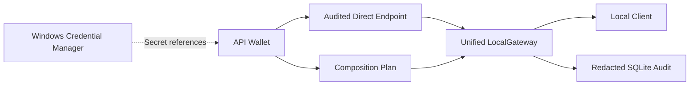

<p align="center">
  
</p>

<h1 align="center">API ARRAY</h1>

<p align="center">
  <strong>API ARRAY 1.0.0 Preview</strong><br>
  A local-first API wallet, audited gateway, and visual composition workspace for Windows.
</p>

<p align="center">
  
  
  
  
  
  
  
  
  
  <a href="LICENSE"></a>
  <a href="https://github.com/CloverIris/API-Array/stargazers"></a>
</p>

<p align="center">
  <a href="README.md">简体中文</a> · <strong>English</strong>
</p>


## Overview

API ARRAY is a local-first API management, audited forwarding, and visual composition tool for Windows 10 and Windows 11. It brings APIs scattered across providers, relay services, and protocols into a secure wallet, then exposes stable, auditable, OpenAI-compatible endpoints through one local gateway.

The product is organized around three clear workflows:

1. **API Wallet** stores providers, base URLs, secret references, capability reports, health status, and budget rules.
2. **Audited Direct Endpoints** publish one wallet asset through an isolated localhost endpoint with its own token, model mapping, lifecycle, and audit trail.
3. **Composition Mode** combines multiple upstream APIs inside Projects, Folders, and Composition Plans, then publishes a new unified API with model routing, health probes, and controlled capability policies.

API ARRAY requires neither Docker nor a separate web server. The desktop host, Rust Runtime, and LocalGateway run as one application, and the runtime can remain available from the system tray after the main window is closed.

<p align="center">
  
</p>


## Highlights

- **Multi-provider API wallet** with built-in manifests for OpenAI, Anthropic, Gemini, and custom OpenAI-compatible services, including multiple instances of one provider.
- **Canonical protocol layer** that translates provider-native requests and responses through Rust adapters while exposing an OpenAI-compatible API.
- **Visual Composition Plans** built from Provider, Composer, Middleware, Probe, and Publisher nodes.
- **Single local audit gateway** shared by Direct Endpoints and Composition Plans while keeping paths, tokens, lifecycle, and audit subjects isolated.
- **Secure credential handling** through Windows Credential Manager; SQLite stores only `secret://` references.
- **Windows Hello protection** for revealing or securely copying API keys on supported Windows 11 systems, with a safe no-reveal fallback on Windows 10.
- **Redacted audit history** for endpoint, model, result, latency, retries, failover, and token usage without storing bodies, URLs, headers, or credentials.
- **Generated API documentation** with Markdown and ready-to-copy examples for cURL, Python, JavaScript/TypeScript, Go, Rust, Java, C#, and C++.
- **Native Windows experience** with Tauri 2, a custom title bar, Mica/Acrylic materials, opaque fallback, tray residency, and autostart support.

## How it works



A Composition Plan describes a canonical service plan instead of simulating individual HTTP request and response flows:

```text
Provider ── Candidate ──> Composer ── ServicePlan ──> Middleware ──> Publisher
Probe ── HealthSignal ────────────────────────────────┘
```

## Security model

- LocalGateway listens on `127.0.0.1:7480` by default. It may be configured to use `::1` and another local port, but the Preview release forbids public interfaces.
- Upstream keys and local endpoint tokens never enter SQLite, logs, notifications, exports, or persistent frontend state.
- Upstream authorization headers are never forwarded to local clients.
- Workspace exports and diagnostic summaries remain redacted.
- Provider YAML is declarative and cannot execute scripts or read arbitrary files.
- Normal runtime requests do not prompt for Windows Hello. Verification is required only when plaintext secrets are intentionally revealed or copied by a user.

## Architecture

| Layer | Technology | Responsibility |
|---|---|---|
| Desktop UI | Next.js 16, React 19, TypeScript 5.9, Tailwind CSS 4, Apps SDK UI | OOBE, wallet, control center, visual editor, documentation, and settings |
| Visual Editor | React Flow / XYFlow 12 | Graph V2 nodes, typed handles, layout, and viewport state |
| Desktop Host | Tauri 2 | Window, tray, file dialogs, IPC, application lifecycle, and Windows integration |
| Core | Rust 1.97, Edition 2024 | Domain models, provider schema, graph validation, compilation, and documentation generation |
| Runtime | Tokio, Axum, Reqwest with Rustls | LocalGateway, adapters, routing, streaming, retry, and audit orchestration |
| Storage | SQLite / rusqlite | Workspace state, audit history, notifications, reports, and versioned configuration |
| Security | Windows Credential Manager, Windows Hello | Secret storage and controlled plaintext reveal/copy operations |

Core and Runtime do not depend on React or Next.js. The frontend operates domain services through controlled Tauri IPC and never accesses the database, credential vault, or upstream APIs directly.

## Repository layout

```text
APIArray/
├── README.md
├── README_EN.md
├── LICENSE
├── docs/                         # Frozen PRD and versioned design changes
└── src/
    ├── product-version.json      # Single version source
    ├── Cargo.toml                # Rust workspace
    ├── providers/                # Built-in Provider YAML
    ├── crates/
    │   ├── apiarray-core/        # Domain, Graph, compiler, and documentation
    │   ├── apiarray-runtime/     # Storage, Gateway, adapters, and audit
    │   ├── apiarray-cli/         # Standalone diagnostic CLI
    │   └── apiarray-windows-security/
    └── apps/desktop/
        ├── src/                  # Next.js / React desktop frontend
        └── src-tauri/            # Tauri Windows host
```

## Requirements

- Windows 10 or Windows 11 x64
- Node.js and npm
- Rust `1.97` or newer
- MSVC C++ Build Tools and Windows SDK
- Microsoft Edge WebView2 Runtime
- WiX Toolset v3 and the Windows VBSCRIPT optional feature when building MSI packages

## Quick start

```powershell
git clone https://github.com/CloverIris/API-Array.git
cd API-Array\src\apps\desktop
npm.cmd install
npm.cmd run dev
```

`npm.cmd run dev` starts the Next.js development server, Tauri desktop host, and in-process Rust Runtime. Do not treat an old executable under `src/target/debug` as a replacement for the complete development workflow.

## Tests and validation

Frontend tests and static export:

```powershell
cd src\apps\desktop
npm.cmd test
npm.cmd run build
```

Rust workspace:

```powershell
cd src
cargo test --workspace
cargo check --workspace
```

Complete desktop Debug build:

```powershell
cd src\apps\desktop
npm.cmd run build:desktop:debug
```

Real provider validation must use credentials explicitly authorized by the user. Start with non-side-effect operations such as `/v1/models`; any potentially billable generation request should remain an explicit user action.

## Build the Preview MSI

```powershell
cd src\apps\desktop
npm.cmd run release:preflight
npm.cmd run release:verify
npm.cmd run release:msi
```

The release workflow validates the version, MSVC, WiX, VBSCRIPT, WebView2 configuration, and icon resources. It produces an MSI, a SHA-256 checksum, and GitHub-ready Preview release notes under `src/release/`. Generated release artifacts are excluded from Git.

The current Preview MSI is unsigned, so Windows SmartScreen may report an unknown publisher. Verify the checksum and obtain installers only from trusted repository or release pages.

## Workspace and local data

API ARRAY stores each workspace as a directory package:

```text
workspace/
├── workspace.sqlite3
├── attachments/
├── exports/
└── backups/
```

The application-level `launcher.sqlite3` records recent workspaces and paths only. Workspace SQLite contains configuration, graphs, reports, notifications, and redacted audit records; actual keys and endpoint tokens remain in Windows Credential Manager.

Workspaces support create, open, relink, copy-verify migration, backup, integrity verification, and compaction. A damaged database enters a recovery path and is never automatically deleted together with its credentials.

## Preview limitations

- Windows 10/11 x64 only.
- OpenAI-compatible output protocol only.
- Loopback-only LocalGateway; no public network exposure.
- No team accounts, RBAC, cloud synchronization, or remote administration.
- No Docker server distribution, automatic updater, or code signing yet.
- Cost values are estimates based on versioned rules and do not replace provider invoices.

## Contributing

Issues and Pull Requests for bugs, design feedback, and provider compatibility improvements are welcome. Before contributing:

1. Read `src/AGENTS.md` and the relevant versioned product design documents.
2. Preserve the boundaries between Core, Runtime, Tauri Host, and Frontend.
3. Save source files and documentation as UTF-8.
4. Add appropriate tests and run both frontend and Rust validation for behavioral changes.
5. Never commit `.env` files, keys, tokens, authorization headers, request bodies, or credential-bearing debug data.

## License

API ARRAY is released under the [MIT License](LICENSE).

## Acknowledgements

API ARRAY is built on the work of these projects and communities:

- [Rust](https://www.rust-lang.org/), [Tokio](https://tokio.rs/), [Axum](https://github.com/tokio-rs/axum), and [Reqwest](https://github.com/seanmonstar/reqwest)
- [Tauri](https://tauri.app/) and Microsoft WebView2
- [React](https://react.dev/), [Next.js](https://nextjs.org/), and [Tailwind CSS](https://tailwindcss.com/)
- [OpenAI Apps SDK UI](https://openai.github.io/apps-sdk-ui/)
- [React Flow / XYFlow](https://reactflow.dev/)
- [SQLite](https://www.sqlite.org/)
- Every developer and tester who reports issues, shares feedback, or maintains an open-source dependency

---

<p align="center">Built locally. Routed safely. Audited clearly.</p>
