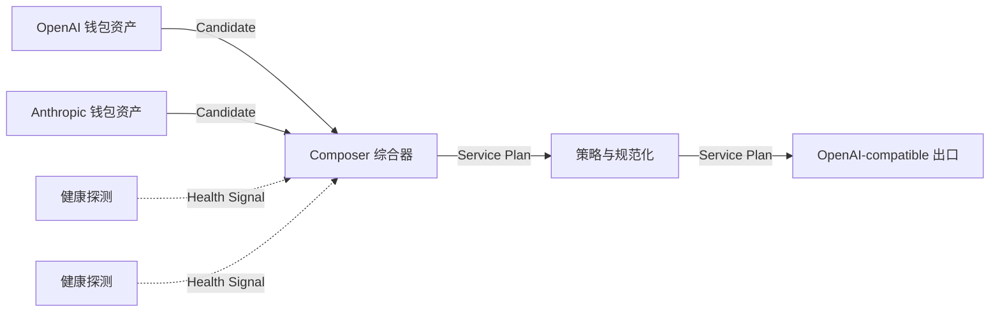
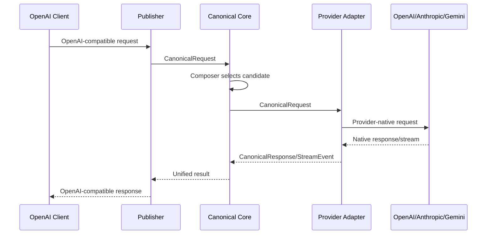

# API ARRAY V0.5：Canonical 编组图与协议综合器

## 1. 决策

Canvas 图描述“服务编组计划”，不描述单次 HTTP 请求和响应的数据流。所有上游协议先转换为 API ARRAY 的 `CanonicalRequest`、`CanonicalResponse` 与 Canonical 流式事件，再由统一的 OpenAI-compatible Publisher 对外发布。

Workspace V6 与 Graph V2 均为破坏性版本。首次发现旧工作区时，删除旧工作区、审计、体检报告及其引用的 `API ARRAY` 凭据，不迁移旧图或旧钱包。

## 2. 节点与端口

| 节点 | 职责 | 输入 | 输出 |
| --- | --- | --- | --- |
| Provider | 引用钱包资产，声明模型、优先级与能力 | 无 | Candidate |
| Composer | 汇聚候选，生成公开模型与路由计划 | Candidate、Health Signal | Service Plan |
| Middleware | 预算、速率、模型别名与受控规范化 | Service Plan | Service Plan |
| Probe | 对目标 Provider 做无副作用探测 | 无 | Health Signal |
| Publisher | Canvas 唯一本地 OpenAI-compatible 出口 | Service Plan | 无 |
| Group | 纯视觉组织 | 无 | 无 |

唯一合法主链为 `Provider → Composer → Middleware* → Publisher`。Probe 只能以 Health Signal 连接 Composer。Group 不得参与运行边。Error、Control、Request、Response 不再是 Graph 端口。

## 3. 协议规范化链路

协议转换是 Provider Adapter 的固有职责，不要求用户添加转换节点。Composer 只处理候选、公开模型、健康、能力和故障切换。

## 4. 模型与能力规则

- 不同模型可作为同一出口中的独立公开模型，例如 `openai/gpt` 与 `anthropic/claude`。
- 多个 Provider 可映射为同一公开模型并按优先级、权重、轮询或延迟选择。
- 工具、图像、JSON、上下文和流式能力必须校验；能力缺失不得静默降级。
- 部分兼容只有在 Composer 显式启用 `allow_capability_degradation` 后才能运行，并在活文档与审计中标记。
- 请求正文、响应正文、Key 和本地 Token 永不进入 Graph、UI State 或审计记录。

## 5. Graph 编译

Canvas Graph 是 Runtime 路由的唯一事实来源。GraphCompiler 将 Provider 节点和 Composer 策略编译为 `RuntimePublisher.routes`。Publisher 配置只保存回环入口、Token 引用和运行意图，不再重复保存上游选择。

