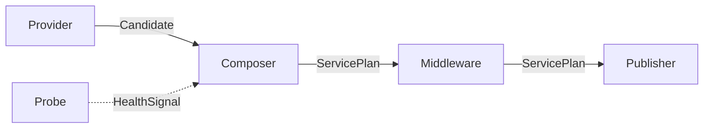

# API ARRAY V0.9：全链路语义审计与可靠性硬化

## 本轮目标

API 钱包保存上游资产，审计直出创建本地直接入口，编组 Canvas 编译统一服务计划。配置事实、运行快照、LocalGateway、审计记录和 UI 状态必须能够相互校验，任何一步失败都不能留下“配置已保存但运行状态未知”的半成功状态。

## 路由与身份

LocalGateway 只监听回环地址和一个共享端口：

```text
/direct/{endpointAlias}/v1
/canvas/{projectId}/{canvasId}/v1
```

Canvas ID 只在 Project 内唯一，因此 Canvas 路由必须携带 Project ID。Canvas 不再拥有独立监听端口。

## Graph V2 运行语义



Graph 结构校验和运行语义校验分离。运行前必须确认唯一 Composer、唯一 Publisher、启用 Provider、钱包资产引用、启用节点可达性、模型能力和 Secret 状态。编译报告记录候选、公开模型、策略、不可达节点、警告和阻塞原因。

## 原子变更

钱包、直出、Canvas 和 Publisher 的修改均采用：内存校验 → SQLite 事务 → 候选 ControlPlane/Gateway 构建 → 成功后切换。凭据写入或删除失败时执行补偿；新 Gateway 失败时保留或恢复旧 Gateway。

## 审计降级

审计写入不记录正文、Header、URL、Key 或本地 Token。审计存储发生错误后，当前请求完成但入口标记为降级，后续请求拒绝并提示修复存储，避免继续伪装成“已审计”。

## 工作区路径

默认优先使用软件目录下的 `workspace/`。目录不可写时回退到 AppData 的工作区目录，并在设置中显示最终实际路径。工作区切换采用复制、验证、切换，失败保持原工作区运行。

## 验证范围

离线测试覆盖 Graph、Gateway、Storage、凭据补偿和 UI 状态；真实验证使用已授权 Provider 完成 `/v1/models`、非流式、流式、故障切换和脱敏审计检查，不执行计费或资源变更操作。
