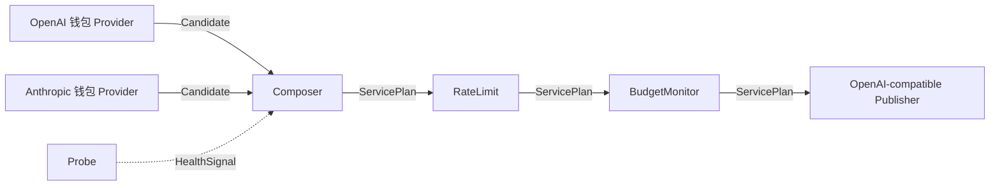

# API ARRAY 1.0.0 Preview：Graph V3 高级编组器

> 本文是 V1.1 第二阶段基线的增量设计。产品版本保持 `1.0.0 Preview`。

## 1. 目标

Graph V3 将编组方案从“能画连接线的拓扑图”升级为可编译、可模拟、可应用并能被 Runtime 真实执行的 API 服务计划。画布描述候选 Provider、公开模型、选择策略、健康探测、受控 Middleware 与唯一 Publisher，不描述单次 HTTP Request/Response 数据流。

协议转换始终由 Canonical Adapter 自动完成。跨 OpenAI、Anthropic、Gemini 的候选并不因为协议不同而天然冲突；只有经能力报告证实的工具、图像、JSON、上下文或流式能力差异才构成降级风险。

## 2. Schema 与安全边界

- `GRAPH_SCHEMA_VERSION = 3`，Workspace Schema 为 7。
- `NodeConfig` 是带类型标签的强类型枚举，禁止任意 JSON 配置。
- Edge 保存 `enabled` 与安全标签；禁用 Edge 不参与编译、可达性和 Runtime。
- Secret、Publisher Token、Header 和正文永不进入 Graph、UI State、日志或编译报告。
- 旧 Schema 不迁移。应用只能展示阻塞式重置页；用户可先备份并输入确认短语后执行重置，启动代码不得自动清理。

## 3. 节点与端口

| 节点 | 运行职责 | 输入 | 输出 |
| --- | --- | --- | --- |
| Provider | 引用钱包资产与上游模型 | — | Candidate |
| Composer | 合并公开模型并选择候选 | Candidate、HealthSignal | ServicePlan |
| Middleware | 执行受控默认值、模型策略、限流和预算观测 | ServicePlan | ServicePlan |
| Probe | 运行 Manifest 声明的无副作用探测 | — | HealthSignal |
| Publisher | 编组方案唯一 OpenAI-compatible 出口 | ServicePlan | — |
| Group | 纯视觉组织、折叠和整体移动 | — | — |

ServicePlan 首版必须保持单链：Composer 只有一个启用输出，每个 Middleware 只有一个启用输入和输出，Publisher 只有一个启用输入。

## 4. Composer 策略

### 优先级故障切换

按健康等级、`priority` 和稳定 ID 选择。只有 `failover_on` 中列出的标准错误允许切换，鉴权失败等未授权错误不得偷偷换线。

### 平滑加权轮询

权重范围为 1–100。游标按 Publisher 与公开模型隔离，仅存在于 Runtime；Graph 和数据库不保存瞬时轮询游标。

### 最低延迟

使用 Probe 与真实请求形成的 EWMA。没有样本时回退优先级；`latency_hysteresis_ms` 保留高优先级候选，防止微小延迟差导致抖动。

## 5. Middleware

- `RequestDefaults`：仅填充调用方未传入的温度、Top P 和最大输出 Token。
- `ModelPolicy`：限制公开模型和每模型最大输出 Token，拒绝时返回标准请求错误。
- `RateLimit`：按入口执行每分钟请求数和并发限制，超限返回 429。
- `BudgetMonitor`：基于真实用量和版本化价格规则产生阈值摘要；预算只预警，不阻断请求。价格未知时不得伪造金额。

计费规则固定采用“直出覆盖规则 / 钱包用户规则 > 内置规则 > 未知”的优先级。估算使用实际上游模型和 Provider 返回的输入、缓存输入、输出 Token；规则来源、版本与估算值进入脱敏审计。跨越配置阈值时只生成一条稳定去重通知，不按请求刷屏。

Middleware 按拓扑顺序编译和执行。禁止脚本、表达式、任意 HTTP 或第三方插件代码。

## 6. Probe 与运行观测

Probe 必须绑定一个存在且启用的 Provider。周期、超时、失败阈值和恢复阈值都经过 Core 校验；调度状态由桌面 Runtime 保存并在重启后恢复。探测结果写入体检报告并更新健康注册表，画布只显示只读运行覆盖层。

`CanvasRuntimeSnapshot` 包含运行版本、草稿是否过期、Provider 健康、延迟 EWMA、模型首选候选、Middleware 顺序和 Publisher 状态。运行覆盖层不得回写 Graph 草稿。

## 7. 编辑、编译与应用

1. 编辑结构或配置，形成未保存本地草稿。
2. 保存时使用 `expectedDraftRevision` 乐观锁写入 SQLite。
3. 编译生成结构化报告，包含稳定错误码、节点/边/字段定位和修复目标。
4. 路由模拟只计算决策，不读取 Secret、不发起网络请求。
5. 运行时才应用草稿，形成新的运行快照；构建失败时旧 Gateway 继续服务。

节点位置、视口和 Group 折叠属于 UI State，不进入运行语义。复制粘贴必须生成新稳定 ID，且不复制 Secret 或 Publisher Token。从 Handle 拖到空白位置时只能创建端口矩阵允许的节点，并立即建立一条类型安全连接；唯一 Composer、唯一 Publisher 与 ServicePlan 不分叉规则仍然生效。

## 8. IPC

- `graph_node_catalog`
- `apply_canvas_template`
- `compile_canvas_graph`
- `simulate_canvas_route`
- `canvas_runtime_snapshot`
- `run_canvas_probe`
- `set_canvas_probe_schedule`
- `reset_workspace_for_graph_v3`

所有编组方案命令必须显式携带 `projectId + canvasId`；保存和模板应用还必须携带 `expectedDraftRevision`。

## 9. 验收标准

- 三种策略具有确定性单元测试；平滑加权状态按 Publisher/模型隔离。
- 跨 Provider 协议通过 Canonical Adapter 编译为统一出口。
- Probe 健康滞回和 RateLimit 在真实 Runtime 生效。
- 默认模板由 Core 生成，前端不拼装第二套 Graph。
- 编译报告能够定位节点、边和字段；缺失 Credential Manager 值必须阻止运行。
- 未确认重置不得删除旧工作区或凭据；备份失败必须阻止重置。
- Core、Runtime、Desktop Rust 测试和 Next.js 静态导出全部通过。
